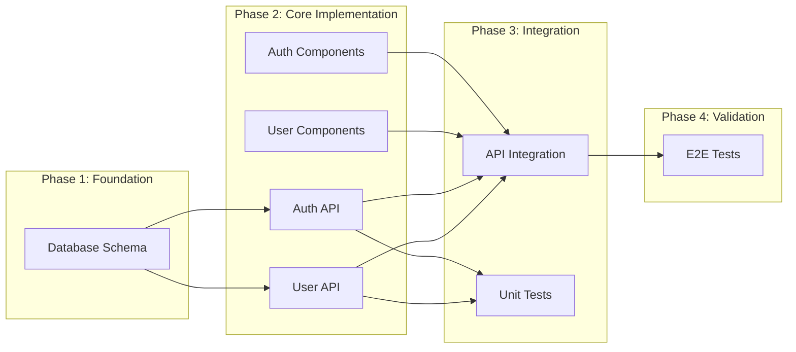
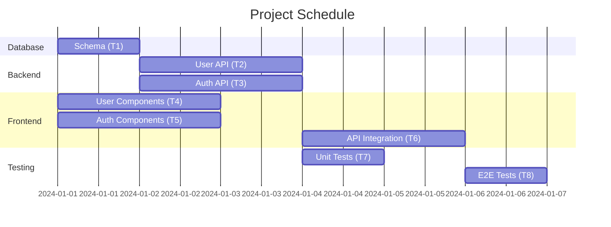

# Dependency Mapper Skill

## Purpose
Identify task dependencies and optimal execution order.

## Dependency Types

### Hard Dependencies
Task B cannot start until Task A completes.
```
A ──► B
```
Examples:
- Schema before API endpoints
- API before frontend integration
- Build before deploy

### Soft Dependencies
Task B benefits from A being done, but can start with mocks/stubs.
```
A ···► B
```
Examples:
- API before frontend (can use mock data)
- Design before frontend (can use placeholder UI)

### No Dependency (Parallel)
Tasks can run simultaneously.
```
A     B
│     │
└──┬──┘
   ▼
   C
```

## Dependency Analysis

### Step 1: List All Tasks
```markdown
| ID | Task | Layer |
|----|------|-------|
| T1 | Database schema | Database |
| T2 | User API | Backend |
| T3 | Auth API | Backend |
| T4 | User components | Frontend |
| T5 | Auth components | Frontend |
| T6 | API integration | Frontend |
| T7 | Unit tests | Testing |
| T8 | E2E tests | Testing |
```

### Step 2: Identify Dependencies
```markdown
| Task | Depends On | Blocks |
|------|------------|--------|
| T1 | - | T2, T3 |
| T2 | T1 | T6, T7 |
| T3 | T1 | T6, T7 |
| T4 | - | T6 |
| T5 | - | T6 |
| T6 | T2, T3, T4, T5 | T8 |
| T7 | T2, T3 | - |
| T8 | T6 | - |
```

### Step 3: Create Dependency Graph



### Step 4: Identify Critical Path

The critical path is the longest sequence of dependent tasks.

```
T1 → T2 → T6 → T8
     or
T1 → T3 → T6 → T8
```

## Execution Planning

### Parallel Execution Opportunities

| Wave | Tasks | Can Run In Parallel |
|------|-------|---------------------|
| 1 | T1 | Single task |
| 2 | T2, T3, T4, T5 | Yes (after T1) |
| 3 | T6, T7 | Partial (T7 can start with T2/T3) |
| 4 | T8 | After T6 |

### Optimized Schedule



## Dependency Matrix

For complex projects, use a matrix:

|     | T1 | T2 | T3 | T4 | T5 | T6 | T7 | T8 |
|-----|----|----|----|----|----|----|----|----|
| T1  | -  |    |    |    |    |    |    |    |
| T2  | ●  | -  |    |    |    |    |    |    |
| T3  | ●  |    | -  |    |    |    |    |    |
| T4  |    |    |    | -  |    |    |    |    |
| T5  |    |    |    |    | -  |    |    |    |
| T6  |    | ●  | ●  | ●  | ●  | -  |    |    |
| T7  |    | ●  | ●  |    |    |    | -  |    |
| T8  |    |    |    |    |    | ●  |    | -  |

● = depends on column task

## Risk Analysis

### Bottleneck Identification
Tasks with many dependencies (T6 depends on 4 tasks) are bottlenecks.

### Mitigation Strategies
1. **Mock data**: Allow frontend to start with mock APIs
2. **Interface contracts**: Define API contracts early
3. **Stub implementations**: Use stubs while waiting for dependencies
4. **Parallel workstreams**: Assign different developers to independent paths

## Output Template

```markdown
## Dependency Analysis: [Project/Feature]

### Task Dependencies
[Dependency table]

### Dependency Graph
[Mermaid diagram]

### Critical Path
[Longest dependency chain with total time]

### Parallel Opportunities
[Tasks that can run simultaneously]

### Bottlenecks
[Tasks with many dependencies or dependents]

### Recommended Execution Order
1. Phase 1: [Tasks]
2. Phase 2: [Tasks]
3. Phase 3: [Tasks]

### Risks
[Identified risks and mitigations]
```
