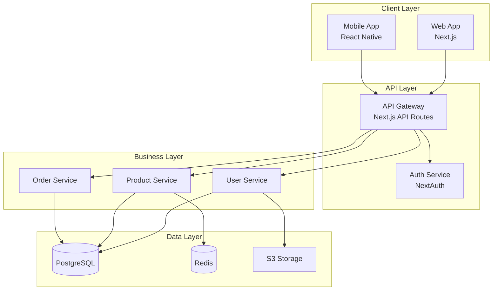
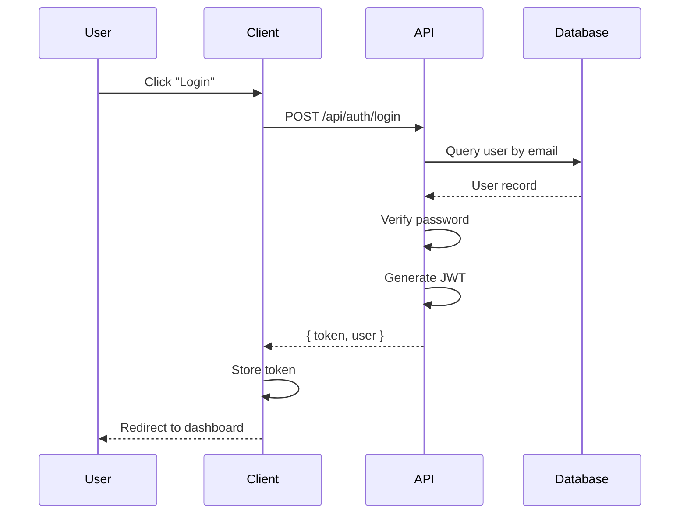
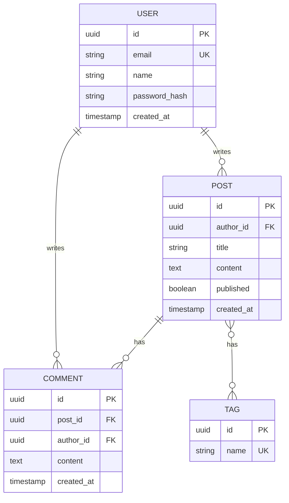
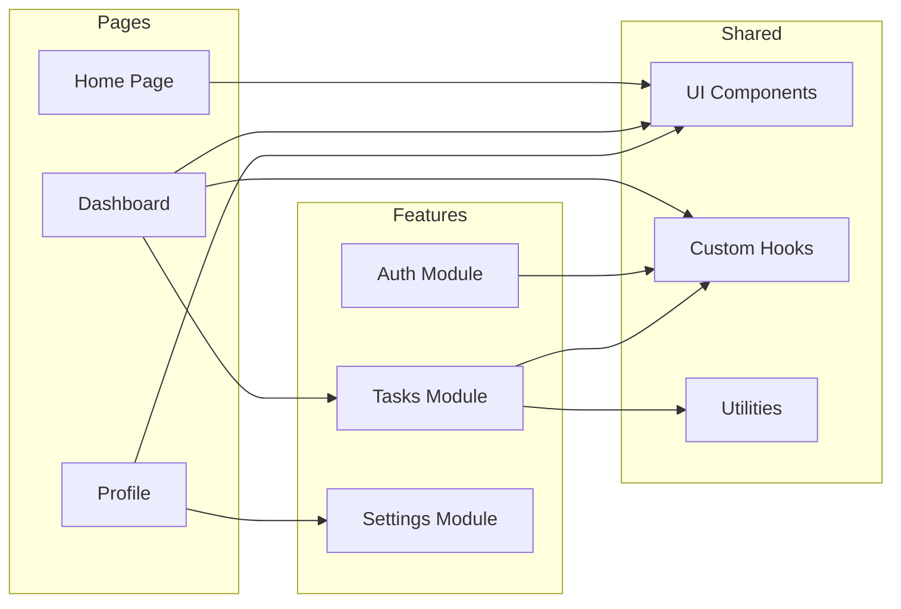
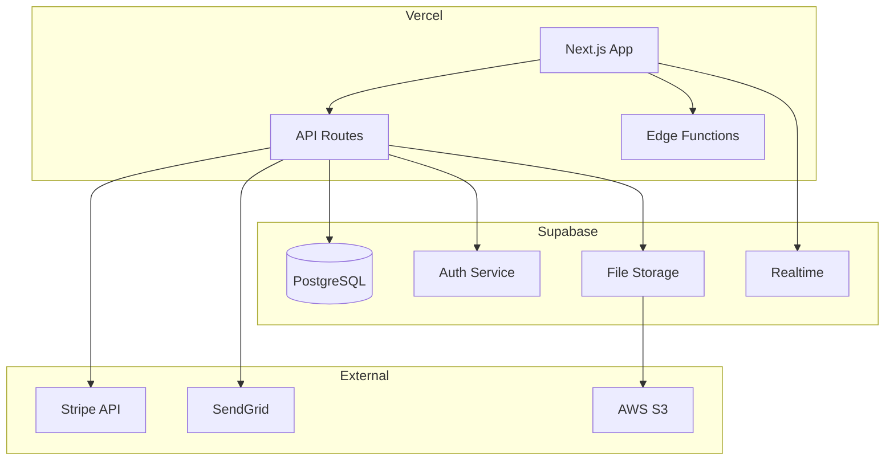
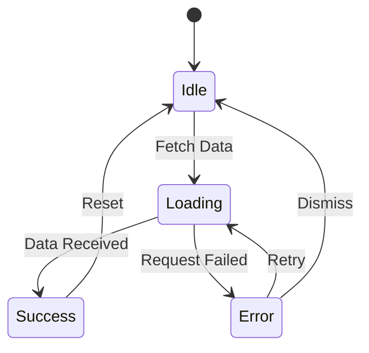
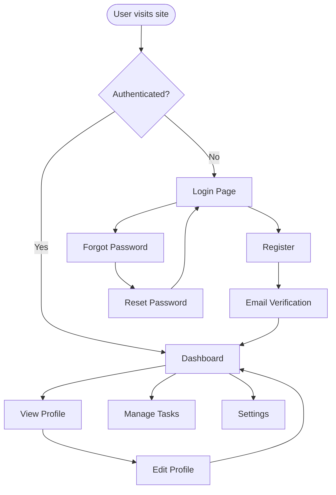

# System Diagrammer Skill

## Purpose
Create clear, maintainable architecture diagrams that document system design.

## Diagram Types

### 1. High-Level Architecture



### 2. Request Flow Diagram



### 3. Database Schema Diagram



### 4. Component Diagram



### 5. Deployment Diagram



### 6. State Flow Diagram



### 7. User Flow Diagram



## Diagram Guidelines

### Clarity
- Use descriptive labels
- Group related components
- Show direction of data flow
- Include technology names where helpful

### Consistency
- Use same shapes for same types
- Consistent color coding
- Standard arrow directions (top-to-bottom, left-to-right)

### Appropriate Detail
- High-level for overview
- Detailed for specific flows
- Don't include everything in one diagram

## Mermaid Syntax Reference

### Shapes
```
[Rectangle] for services
([Stadium]) for start/end
{Diamond} for decisions
[(Database)] for data stores
{{Hexagon}} for preparation
```

### Arrows
```
--> Solid arrow
-.-> Dashed arrow
==> Thick arrow
--text--> Arrow with label
```

### Subgraphs
```mermaid
subgraph "Group Name"
    A --> B
end
```

## Output Format

When creating diagrams, provide:
1. The Mermaid code block
2. Brief explanation of the diagram
3. Key architectural decisions shown
